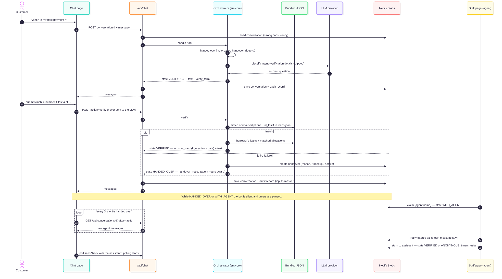

# Architecture

> **Status: BUILT (M0–M8), refinements in progress (M9–M10, see [ROADMAP.md](ROADMAP.md)).** This document started as the design; items still marked *Proposed* were implemented as described unless the CHANGELOG says otherwise. When a decision changes, update it here and add an entry to [CHANGELOG.md](CHANGELOG.md).

## 1. Design principles

1. **The LLM talks; code decides.** The model classifies intent, rewrites retrieved policy into plain language, and drafts replies. Code enforces verification, data access, arithmetic and handover. The model never generates a figure.
2. **Fail safe, not silent.** If retrieval finds nothing relevant, the data is missing, or the LLM call fails, the assistant says so and offers a human. It never guesses.
3. **Deterministic where it matters.** Verification, handover triggers that can be detected by rules, and account figures are plain code with tests.
4. **Everything traceable.** Each reply records what it was based on: source documents, data rows, and the rule that fired.
5. **Small and deployable in two hours.** Prefer one service and one datastore over several moving parts.

## 2. Components (proposed)

### 2.1 Full system



The diagram has five zones:
1. **Offline Python pipeline:** extract and clean the data, match it with DuckDB SQL, then run the checks.
2. **The JSON contract.**
3. **GitHub and CI.**
4. **Netlify:** the build gate, static pages, thin functions, `src/core` logic, bundled JSON and Blobs.
5. **External services.**

Dashed boxes are stretch items.

### 2.2 One chat turn (verification path)



### 2.3 Conversation states


**Diagram sources:** the `.mmd` files in [diagrams/](diagrams/) are the source of truth. GitHub renders Mermaid natively. To regenerate the SVGs after editing a source:

```bash
cd docs/diagrams
npx -y -p @mermaid-js/mermaid-cli mmdc -i system.mmd -o system.svg -b white
```

The API server, UIs and all runtime logic are **TypeScript**. The JSON in `data/generated/` is produced offline by **Python** scripts (§4).

| Component | Responsibility |
|---|---|
| Customer chat UI | Send messages and show replies with source citations. Shows a "transferred to an agent" state when handed over |
| Staff queue UI (Agent view) | Lists handed-over conversations with the transcript, customer details and the handover reason. The agent claims a conversation, replies in the same chat, and returns it to the assistant when done |
| Conversation orchestrator | Holds per-conversation state (see §5) and routes each message |
| Guardrails / rules | Verification checks, attempt counting, and rule-based handover detection |
| Account service | Lookups over `loans.json` and `allocations.json`, **scoped to the verified borrower only** |
| Policy retrieval | Finds relevant KB chunks and returns them with document names |
| LLM client | A single wrapper with timeouts, limited retries, and a safe fallback reply |
| Audit log | Records each turn: who, what was said, sources, data rows, rule fired |

## 3. Technology choices

| Area | Choice | Status | Why |
|---|---|---|---|
| Hosting | **Netlify**: static pages + Netlify Functions | **Decided** | Easy git-based or CLI deploys, HTTPS by default, and one platform for the frontend, API and storage |
| Language (runtime) | **TypeScript** (Node.js) for everything deployed: functions, frontend, runtime tests | **Decided** | Xavier Africa's primary language. Netlify Functions run it natively; they don't run Python |
| Language (offline scripts) | **Python 3.13** for `scripts/`: ingest, KB chunking, payment allocation, smoke test | **Decided** | pandas suits the messy data. The scripts run locally, never on Netlify |
| Language boundary | **JSON files in `data/generated/` are the contract** between Python and TypeScript (§4.1) | **Decided** | The two sides only meet at documented, versioned files |
| Frontend | **Vite** multi-page build with vanilla TypeScript (`index.html` chat, `staff.html` queue) | Proposed | Two small pages need no framework. Netlify detects Vite automatically |
| API | **Netlify Functions** (modern `Request`/`Response` API, routed with `config.path` to `/api/*`) | Proposed | No server to manage. Synchronous functions time out at **60 s**, which is enough for one LLM call per turn |
| Reference data (loans, payments, KB) | **JSON bundled with the functions**, generated by an ingest script | Proposed | Read-only and small (150 loans, 32 payments, 11 docs). Nothing to provision, and it's versioned in git |
| Mutable state (conversations, handover queue, audit log) | **Netlify Blobs** (strong consistency) behind a small `Store` interface | Proposed | Zero configuration, works in `netlify dev`, persists across deploys. See §3.2 for the trade-off with Netlify Database |
| Retrieval | **BM25 keyword search** (MiniSearch) over pre-chunked KB, plus optional embeddings computed at ingest time | Proposed | 11 short documents don't need a vector database. BM25 works whatever the LLM provider offers |
| LLM | Provider of the key supplied on the day, called directly behind one `llm.ts` wrapper | Proposed | The brief requires that key. The wrapper isolates the provider and handles timeouts and fallbacks |
| Document parsing (Python) | `pandas` + `openpyxl` (xlsx), `python-docx` (docx), `pdfplumber` (pdf) | Proposed | Mature libraries. Run once locally; output committed |
| Matching and checks (SQL) | **DuckDB** (in-process, inside the Python ingest). Queries live in `scripts/sql/*.sql` | **Decided** | Payment allocation is a join-and-deduplicate problem, so SQL is the right tool. No server, no deploy risk, and the JSON contract is unchanged (§4.2) |
| Tests | **Vitest** (TypeScript runtime) + **pytest** (Python scripts) | Proposed | Each side is tested in its own language. Shared contract fixtures keep them in step (§4.1) |

### 3.1 Netlify layout

```text
Browser ──▶ Netlify CDN ── static: /index.html (chat), /staff.html (queue + audit)
                 │
                 └──▶ /api/* ──▶ Netlify Functions (thin adapters)
                                    │
                                    ├─▶ src/core/*   pure logic (tested, platform-independent)
                                    ├─▶ data/generated/*.json   (bundled, read-only)
                                    ├─▶ Netlify Blobs  (conversations/, handovers/, audit/)
                                    └─▶ LLM provider API  (key in env var)
```

| Endpoint | Method | Purpose |
|---|---|---|
| `/api/chat` | POST | One customer turn: `{conversationId, message}` → `{reply, sources, state}` |
| `/api/conversation/:id?after=<messageId>` | GET | Reload a conversation after a refresh, and **poll for new agent messages** (returns only messages after `after`) |
| `/api/handovers` | GET | Staff queue (needs the staff token) |
| `/api/handovers/:id/claim` | POST | Agent claims a conversation: `{agentName}` → state `WITH_AGENT`. Fails if another agent already holds it |
| `/api/handovers/:id/reply` | POST | Agent sends a message: `{text}` (claiming agent only) |
| `/api/handovers/:id/return` | POST | Agent returns the conversation to the assistant: `{note?}` → back to `ANONYMOUS` or `VERIFIED` |
| `/api/audit` | GET | Audit records, filterable by conversation (needs the staff token) |
| `/api/health` | GET | Commit SHA, schema version, `as_at`, data counts, Blobs check. See [OPERATIONS.md](OPERATIONS.md) §3 |

Deployment, CI/CD, monitoring and runbooks are in [OPERATIONS.md](OPERATIONS.md). **Blobs store names are prefixed with the deploy context**, so deploy previews never write into production data.

**Key rule:** functions stay thin. All the logic lives in `src/core/`: verification, handover rules, account answers, allocation, retrieval and agent hours. That makes it testable without Netlify and portable if hosting changes.

### 3.2 Storage trade-off: Netlify Blobs vs Netlify Database

| | Netlify Blobs (proposed) | Netlify Database (managed Postgres) |
|---|---|---|
| Setup | None | `netlify db init`, plus migrations |
| Plan | All plans | Credit-based plans only. Check the account first |
| Local dev | Sandboxed local store in `netlify dev` | Supported |
| Querying | Get by key, list by prefix | Full SQL |
| Concurrency | Last write wins | Transactions |
| Fit here | One writer per conversation, low volume, a 2-hour build | Better if staff mode or audit reporting grows |

Blobs is the lower-risk choice for the time available. The `Store` interface means moving to Postgres later only changes one file.

**Key layout (because Blobs is last-write-wins).** With Agent view, the customer and the agent can write to the same conversation at the same moment. If the whole conversation were one blob, one of those writes would be lost. So:
- Each message is its **own key**: `conversations/<id>/messages/<timestamp>-<random>`. Appends never overwrite each other. Listing by prefix returns them in order.
- Conversation state (state, verified borrower, claiming agent, session times) is a **separate small key**: `conversations/<id>/meta`. It changes only at defined transitions.
- `handovers/<id>` holds the queue entry. Claiming checks and writes it with strong consistency. The claim also records `claimedAt`, so a duplicate claim is detected and refused on the next read.

**Residual race:** two agents pressing *Claim* in the same instant could both succeed, because Blobs has no compare-and-swap. That's acceptable with four agents. Postgres or Redis would fix it properly ([OPERATIONS.md](OPERATIONS.md) §6.2).

### 3.3 Netlify-specific concerns

- **Time zone.** Functions run in UTC and Botswana is UTC+2 (`Africa/Gaborone`). Agent-hours logic must convert explicitly.
- **Simulated date.** `APP_TODAY=2026-10-06` is an environment variable, read in one config module. Time of day comes from the real clock in Botswana time, unless an `APP_NOW` override is set for demos and tests.
- **LLM latency.** Use one LLM call per turn where possible, a timeout of about 20 s, and at most one retry. Then fall back to a safe reply and offer handover. This stays well within the 60 s function limit.
- **Cold starts.** Load the bundled JSON and build the search index once per function instance, at module scope.
- **Secrets.** `LLM_API_KEY` and `STAFF_TOKEN` are Netlify environment variables. Locally they live in `.env`, which is git-ignored.
- **Data residency.** Functions default to US East (Ohio) and customer data stays there. That's acceptable for an assessment, but it's a limitation to flag for a real Botswana lender.
- **Staff access.** The staff page and APIs check a shared `STAFF_TOKEN`. That's minimal but honest; proper staff login is listed as next steps.

### 3.4 Proposed repository layout

```text
netlify.toml                 build + functions config
package.json                 TypeScript deps + npm scripts
.env.example                 LLM_API_KEY, STAFF_TOKEN, APP_TODAY

scripts/                     ── PYTHON (offline, never deployed) ──
  requirements.txt           pinned: pandas, openpyxl, duckdb, python-docx, pdfplumber, pytest, requests
  ingest.py                  entry point: runs all steps, writes data/generated/
  kopano/cleaning.py         phones (mirrors src/core/phone.ts), references, amounts, dates
  kopano/kb.py               KB docs → kb-chunks.json
  (loading, DuckDB and writing the contract live in ingest.py)
  sql/                       ── SQL (DuckDB) ──
    01_duplicates.sql        flag repeated txn_ref (window function)
    02_match_reference.sql   join payments → loans on normalised reference, with a name check
    03_match_phone.sql       fallback join on payer phone for unreferenced payments
    04_allocations.sql       final status per payment → allocations.json
    05_summary.sql           aggregates for manifest.json counts and the ingest report
    90_checks.sql            data-quality assertions: each query must return 0 rows
  smoke_test.py              scripted conversations against a deployed URL
  tests/                     pytest

data/
  generated/                 ── THE CONTRACT (committed, bundled with functions) ──
    manifest.json            schema version, generated_at, as_at, source file hashes
    loans.json  payments.json  allocations.json  kb-chunks.json
  contract/
    phone-cases.json         shared test vectors: raw input → normalised (used by pytest AND Vitest)

src/core/                    ── TYPESCRIPT (runtime) ──
                             config, contract (types + loader), phone, masking, store,
                             conversation-store, hours, llm, retrieval, handover-rules,
                             account, agent, orchestrator, runtime
src/web/                     index.html, staff.html, chat.ts, staff.ts, styles.css
netlify/functions/           health.ts, chat.ts, conversation.ts, handovers.ts (queue, detail + audit, claim/reply/return)
tests/                       Vitest: unit + scripted conversations (LLM mocked) + contract checks
docs/                        this documentation
```

## 4. Data loading

**Source:** `kopano_data.xlsx` and `Knowledge_Base/`.

**How it runs:** `python scripts/ingest.py` runs locally. It writes clean JSON to `data/generated/`, which is committed to git and bundled with the Netlify Functions.

**Pipeline — Python cleans, SQL matches and checks, Python writes:**

```text
kopano_data.xlsx ──▶ [Python] extract + clean ──▶ DuckDB (in memory) ──▶ [SQL] scripts/sql/01…05 ──▶ [Python] write JSON contract
Knowledge_Base/  ──▶ [Python] extract + chunk ─────────────────────────────────────────────────────▶ kb-chunks.json
                                                      │
                                                      └──▶ [SQL] 90_checks.sql — any row returned = ingest FAILS
```

1. **Extract and clean (Python):**
   - Parse the xlsx.
   - Normalise phones, payment references, amounts (to thebe) and dates.
   - Rules that use regular expressions stay in Python, where they are unit-tested and mirrored in TypeScript where needed.
2. **Load (Python → DuckDB):** register the cleaned DataFrames as the tables `loans` and `payments` in an in-memory DuckDB database.
3. **Match and summarise (SQL):**
   - Run `scripts/sql/01–05` in filename order.
   - Each file is plain SQL that can be read, reviewed and run by hand in the DuckDB CLI.
4. **Check (SQL):**
   - Run `90_checks.sql`. Each check is a query that must return **zero rows**.
   - Any rows returned stop the ingest with a readable error, so bad data never reaches the contract.
5. **Write (Python):** read the query results and write the JSON contract files and `manifest.json`.
6. **Optional:** set `--keep-db` to also save `data/build/kopano.duckdb` (git-ignored) for inspection.

**Why ingest ahead of time:**
- Parsing messy spreadsheets and PDFs is the most error-prone step, so it happens once, where the output can be inspected and diffed in git.
- Netlify builds stay simple, with no Python on Netlify.
- Payment allocation is computed here too, since both inputs are static.
- If the data changes (including a live change in the walkthrough), re-run the script, commit and redeploy.

| Source | Output file | Load notes |
|---|---|---|
| Loans sheet | `loans.json` | Read columns A–U only. Ignore column V (SQL formulas) and the stray formula row (~row 218). Convert Excel date serials. Add `phone_normalised` |
| Payments sheet | `payments.json` | Parse amounts (`P 1,980.00` → `198000` thebe), both date formats and phone formats. Keep the raw values alongside the cleaned ones for audit |
| Loans + Payments | `allocations.json` | Payment allocation results (§9) |
| `Knowledge_Base/` | `kb-chunks.json` | Chunk by heading. Tag each chunk with version, effective date and superseded status |
| Contact History sheet | — | Not needed for the chosen scope |
| Read Me sheet | `manifest.json` (`as_at`) | Documentation only |

**Phone normalisation:**
1. Remove spaces and `+`.
2. Strip a leading `00267` or `267`.
3. Strip a leading `0` on a 9-digit local number.
4. Compare the resulting 8-digit number (e.g. `71084258`).

This is implemented twice: in `scripts/kopano/phone.py` (for loans and payments) and in `src/core/phone.ts` (for what the customer types). Both are tested against the same `data/contract/phone-cases.json`, so they can't drift apart.

**Money:** stored as **integer thebe** (1 BWP = 100 thebe) everywhere in the contract, never floats. Converted to `P1,234.56` only for display.

### 4.1 The data contract (`data/generated/`)

The Python scripts **produce** these files; the TypeScript runtime only **reads** them. Neither side reaches into the other's code.

**Rules:**
1. **Every file has a `schema_version`.** `manifest.json` records it with `generated_at`, `as_at` (`2026-09-30`), and SHA-256 hashes of the source files.
2. **Breaking changes bump the major version.** Renaming or removing a field, or changing its type or units, is breaking. The TypeScript loader **refuses to start** on an unknown major version rather than misread data.
3. **Adding a field is non-breaking.** Bump the minor version; TypeScript ignores fields it doesn't know.
4. **Field naming is `snake_case`, dates are ISO `YYYY-MM-DD` (or ISO 8601 with `+02:00` for timestamps), and money is integer thebe with a `_thebe` suffix.**
5. **TypeScript types for the contract live in `src/core/contract.ts`.** The Vitest suite loads the real files and validates them against those types, so a bad ingest fails the tests, not the demo.
6. **Every change to the contract** is updated here and noted in the CHANGELOG.

**Files (schema v1.0, proposed):**

| File | Shape | Key fields |
|---|---|---|
| `manifest.json` | object | `schema_version`, `generated_at`, `as_at`, `today`, `sources: [{path, sha256}]`, `counts` |
| `loans.json` | array of loans | `loan_id`, `borrower_id`, `first_name`, `last_name`, `phone_raw`, `phone_normalised`, `id_last4`, `branch`, `loan_officer`, `product`, `disbursed_on`, `principal_thebe`, `term_months`, `monthly_instalment_thebe`, `instalments_paid`, `arrears_thebe`, `penalties_thebe`, `outstanding_balance_thebe`, `next_due_date`, `days_overdue`, `status`, `payment_holiday_used` |
| `payments.json` | array of payments | `row_id`, `txn_ref`, `received_at`, `channel`, `payer_name`, `payer_phone_raw`, `payer_phone_normalised` (nullable), `reference_raw`, `reference_normalised` (nullable, e.g. `KM-L-0141`), `amount_raw`, `amount_thebe`, `is_duplicate_of` (nullable `row_id`) |
| `allocations.json` | array, one per payment | `row_id`, `loan_id` (nullable), `status` (`matched` / `needs_review` / `duplicate` / `unmatched`), `method` (`reference` / `phone` / `none`), `confidence`, `reasons: string[]` |
| `kb-chunks.json` | array of chunks | `chunk_id`, `document`, `section`, `text`, `version` (nullable), `effective_date` (nullable), `superseded` (bool), `superseded_by` (nullable) |

**Privacy note:** `loans.json` contains `id_last4` and phone numbers. It's bundled server-side only. It must **never** be served to the browser or placed in `public/`.

### 4.2 SQL stage: payment allocation and data checks

**Why SQL here:**
- Matching payments to loans is a join.
- Finding duplicates is a window function.
- Summaries are aggregates.

Writing these as SQL makes the matching rules short, declarative and reviewable, which matters because a wrong allocation tells a customer they've paid when they haven't.

**What SQL does:**
- Joins the cleaned tables.
- Assigns a status to each payment.
- Summarises the results.
- Runs the data-quality checks.

**What SQL does NOT do:**
- Messy string cleaning, which stays in Python.
- Anything at runtime. The deployed app still reads JSON.

**Allocation rules (conservative; client decision D8 may change them):**

| Order | Rule | Resulting status |
|---|---|---|
| 1 | Same `txn_ref` seen earlier | `duplicate`: excluded from totals and flagged for staff review |
| 2 | `reference_normalised` matches a `loan_id` **and** the payer's surname appears in the borrower's name | `matched` (method `reference`) |
| 3 | Reference matches a loan but the **name does not** (e.g. EFT from "O SEBEGO" referencing KM-L-0078, Masego Phiri) | `needs_review`: a likely wrong or transposed reference |
| 4 | No usable reference; payer phone matches **exactly one** loan | `needs_review` (method `phone`): candidate only, never shown to a customer as paid |
| 5 | No usable reference; phone matches several loans (e.g. KB-10078) or none | `needs_review` or `unmatched` |

Only `matched` payments change what a customer sees ("we've received P X on 4 Oct that isn't reflected yet"). Everything else is handled by a human.

**Illustrative SQL (design sketch, not final code):**

```sql
-- 01_duplicates.sql: keep the first occurrence of each txn_ref
CREATE TABLE payments_dedup AS
SELECT *,
       ROW_NUMBER() OVER (PARTITION BY txn_ref ORDER BY received_at) AS occurrence,
       FIRST_VALUE(row_id) OVER (PARTITION BY txn_ref ORDER BY received_at) AS first_row_id
FROM payments;

-- 02_match_reference.sql: reference join with a name sanity check
CREATE TABLE ref_matches AS
SELECT p.row_id,
       l.loan_id,
       CASE WHEN upper(p.payer_name) LIKE '%' || upper(l.last_name) || '%'
            THEN 'matched' ELSE 'needs_review' END AS status,
       'reference' AS method
FROM payments_dedup p
JOIN loans l ON l.loan_id = p.reference_normalised
WHERE p.occurrence = 1;

-- 90_checks.sql: every query must return zero rows
SELECT row_id FROM allocations GROUP BY row_id HAVING count(*) > 1;           -- allocated twice
SELECT a.row_id FROM allocations a LEFT JOIN loans l USING (loan_id)
 WHERE a.loan_id IS NOT NULL AND l.loan_id IS NULL;                            -- unknown loan
SELECT loan_id FROM loans
 WHERE outstanding_balance_thebe <>
       (term_months - instalments_paid) * monthly_instalment_thebe + penalties_thebe; -- balance identity
```

**Balance check:** I confirmed this identity holds for all 150 loans during discovery (with a tolerance of P1 before the conversion to thebe). The final check may need the same rounding tolerance.

**Tests:** pytest loads small fixture tables into DuckDB, runs each `.sql` file and asserts the expected statuses. The fixtures cover a clean reference, a messy reference, the O SEBEGO case, a duplicate, a phone-only payment and a multi-loan phone.

**Ingest report:** `05_summary.sql` prints counts by status (and totals in pula) to the console. The same counts go into `manifest.json`, so a reviewer can see at a glance what the allocation did.

## 5. Conversation flow

State is held server-side per conversation:

```
 ANONYMOUS ──(asks about own account)──▶ VERIFYING ──(match)──▶ VERIFIED
     │                                      │                        │
     │                                      └─(3rd failure)──┐       │
     └──────── any handover trigger, from any bot state ─────┼───────┘
                                                             ▼
                                                        HANDED_OVER  (queued; bot silent)
                                                             │ agent claims
                                                             ▼
                                                        WITH_AGENT   (agent replies in the same chat; bot silent)
                                                             │ agent presses "Return to assistant"
                                                             ▼
                                   back to VERIFIED (if the customer was verified) or ANONYMOUS

 Any state ──(60 min since start, or 5 min idle while the BOT is in control)──▶ CLOSED
```

- **ANONYMOUS:** general policy questions are answered (they are not personal information). Any account question starts verification.
- **VERIFYING:** ask for the registered mobile number and the last 4 digits of the Omang/passport. Both must match the **same** loan record. Failures are counted server-side. The third failure triggers handover.
- **VERIFIED:** the conversation is bound to one `borrower_id` **for the rest of the session**. Account queries can only read that borrower's loans. If the borrower has more than one loan, list them and ask which one, or answer for each (see Open decisions).
- **HANDED_OVER:** the assistant sends one transfer message, then **does not reply**. Customer messages are stored for the agent. **Unverified customers are handed over straight away**, with no contact details collected (client decision); the agent can verify them in the chat if needed.
- **WITH_AGENT:** an agent has claimed the conversation and replies in the same chat. The **bot stays paused**.
- **Return to assistant:** only the agent can do this. The bot posts "You're back with the Kopano Assistant", and the conversation resumes in `VERIFIED` if the customer was verified earlier in the session, otherwise `ANONYMOUS`. The agent may add a note, which is recorded in the audit log but not shown to the customer.
- **CLOSED:** the session has ended. Further messages are refused, and the page offers "Start a new chat". A new chat must verify again.

This satisfies the brief's "once handed over, the assistant stops replying": the bot is silent for the whole time a human is responsible, and only a human can hand control back.

**Session rules (client decision):**

| Rule | Value | Applies when |
|---|---|---|
| Maximum session length | 60 minutes from the first message | Bot in control (`ANONYMOUS`, `VERIFYING`, `VERIFIED`) |
| Idle timeout | 5 minutes with no customer message | Bot in control |
| **Timers paused** | — | `HANDED_OVER` and `WITH_AGENT`. The customer must not be timed out while waiting for, or talking to, a person |
| Timers after handback | Both timers restart from the moment of return | Bot back in control |

- **Outside agent hours:** on handover, the customer is told when agents are next available (Mon–Fri 08:00–17:00, Sat 08:30–13:00). The handover **stays in the queue**. If the customer leaves, they can come back later on the same device to see the agent's reply: the conversation ID is kept in `localStorage`, and the agent's reply is waiting in the chat.
- **When a returning customer can see the history:** without the device, they start a new chat and must verify again. The transcript is **not shown to a new, unverified chat**, because it may contain account details.
- **Timers are enforced server-side.** The page only displays them. Each request checks `startedAt` and `lastCustomerMessageAt` in `meta`.

### Message routing (per turn)

1. Check the session. If it's `CLOSED` or past its time limits, close it and reply with the closed notice. If the conversation is `HANDED_OVER` or `WITH_AGENT`, store the message for the agent and stop (**no bot reply, no LLM call**).
2. **Verification submission** (sent from the verification form, §5.1): check it in code. It **never goes to the LLM**, and the stored copy is masked.
3. Run **rule-based handover checks** (keywords and patterns for agent requests, disputes, hardship, payment holiday, restructuring, top-up, complaints and fraud).
4. Use the LLM to **classify intent**: policy question / account question / handover / small talk / out of scope. A handover result from either step 3 or step 4 wins.
5. **Policy question:** retrieve chunks, generate an answer **only from those chunks**, and cite the document names. If nothing relevant is found, say so and offer handover.
6. **Account question:** require `VERIFIED`, look up the borrower's rows in `loans.json` and `allocations.json`, and **render figures from a code template**. The LLM may phrase the text around the figures but never produces them.
7. Write an audit record.

### 5.1 Chat interface (customer page)

**How it's built:**
- `src/web/index.html`, `chat.ts` and `styles.css`: vanilla TypeScript bundled by Vite. No framework and no UI library.
- The whole page is aimed at **under 50 KB**, because customers are mostly on phones and mobile data.

**Layout (mobile-first, works at 360 px wide):**

```text
┌──────────────────────────────────────┐
│ Kopano Assistant                     │  header
│ ● Agents online until 17:00          │  agent-hours status (Botswana time)
├──────────────────────────────────────┤
│ Hi! I can help with payments,        │
│ balances and our policies.           │  assistant bubble (left)
│ [My balance] [Next payment]          │
│ [How to pay] [Paying late]           │  suggested questions (chips)
│                                      │
│              How do I pay by MyZaka? │  customer bubble (right)
│                                      │
│ Open MyZaka → Pay Merchant → 88031,  │
│ use your loan ID as the reference…   │
│ 📄 How to Pay Your Loan              │  source chip(s) under policy answers
│                                      │
│ ┌ Verify your identity ────────────┐ │  inline form (only while VERIFYING)
│ │ Mobile number [ 71 555 204     ] │ │
│ │ Last 4 of ID  [ ••••           ] │ │
│ │                        [Verify]  │ │
│ └──────────────────────────────────┘ │
│ ┌ KM-L-0007 · Salary Advance ──────┐ │  account card (figures rendered by code)
│ │ Next payment   P1,500.00 · 25 Oct│ │
│ │ Balance        P7,500.00         │ │
│ │ As at 30 Sep 2026 — recent       │ │
│ │ payments may not show yet        │ │
│ └──────────────────────────────────┘ │
├──────────────────────────────────────┤
│ [ Type your question…        ] [Send]│
│ Kopano will never ask for your PIN.  │  footer safety note
└──────────────────────────────────────┘
```

**Message types.** The server returns structured messages and the page renders each type differently:

| Type | Rendered as | Notes |
|---|---|---|
| `text` | A chat bubble | Plain text only. Rendered with `textContent`, never `innerHTML`, so it can't be used for script injection |
| `sources` | Document chips under the bubble | Human-readable document titles, e.g. "Late Payment Policy (v3.0)" |
| `account_card` | A card with labelled figures | Figures come as numbers from the server and are formatted in code. The "as at" caveat is always shown. `matched` payments appear as "Received, not yet reflected: P X" |
| `verify_form` | An inline form with two fields | Mobile number (`inputmode=tel`) and last 4 digits (`inputmode=numeric`, `maxlength=4`, masked) |
| `handover_notice` | A full-width banner | "You've been transferred to a Kopano agent", plus the expected response time from the agent-hours logic |
| `error` | A muted bubble with a Retry button | For network errors, timeouts or an LLM outage. It always offers an agent |

**API used by the page:**
- `POST /api/chat`
  - Request: `{ conversationId?, message }` or `{ conversationId, action: "verify", phone, idLast4 }`
  - Response: `{ conversationId, state, messages: Message[] }`
- `GET /api/conversation/:id` reloads the transcript after a page refresh.
- `GET /api/conversation/:id?after=<messageId>` is **polled every 3 s while the state is `HANDED_OVER` or `WITH_AGENT`**, to show agent messages. Netlify Functions can't hold a connection open, so polling replaces push updates. Polling stops when the bot is back in control or the page is hidden.
- It's plain request and response, with no streaming. Replies are short, figures arrive whole, and it keeps the function simple.

**Behaviour:**
- **Conversation ID.** The server creates it on the first message. The page keeps it in `localStorage` (wrapped in `try/catch`) so a page refresh continues the same chat. A "Start new chat" link clears it.
- **While waiting.** The page shows a typing indicator, disables Send, and gives up after 30 s with an `error` bubble and a Retry button.
- **Verification.**
  - When the server asks for verification, it sends a `verify_form`.
  - Submitting the form sends `action: "verify"`, which is checked in code and never passed to the LLM.
  - If the customer types their number and digits into the normal chat box instead, the server spots them with a pattern match and removes them before any text reaches the LLM.
  - Transcripts and the audit log store them masked, e.g. `71•••204` and `••21`.
- **Session.** It lasts at most 60 minutes, closes after 5 minutes idle while the bot is in control, and the timers pause during handover (§5). Verification lasts for the rest of the session. A closed session shows "This chat has ended" and a "Start a new chat" button. Short sessions also protect shared phones and cybercafés.
- **After handover.**
  - A `handover_notice` banner appears: "Connecting you to a Kopano agent" (or, outside hours, when agents are next available). The assistant stops replying.
  - The input stays open with the placeholder "Message the agent". Messages are stored for the agent, with no bot reply.
  - When an agent claims the chat, a notice says "Kagiso from Kopano has joined". Agent messages appear as a **distinct bubble style labelled with the agent's name**, so the customer always knows whether they're talking to a person or the bot.
  - When the agent returns the chat, a notice says "You're back with the Kopano Assistant" and the bot resumes.
- **Accessibility.**
  - The message list is an `aria-live="polite"` region.
  - Enter sends the message and Shift+Enter adds a new line.
  - Every field has a label, and focus returns to the input after each reply.
  - Colours meet contrast guidelines.
- **Language.** English only for now. Setswana is IDEAS I-006.

**One customer turn, end to end:**

```text
Customer types "When is my next payment?" ──▶ POST /api/chat
  server: state = ANONYMOUS → account intent → state = VERIFYING
  ◀── [text "I'll need to verify you first", verify_form]
Customer submits the form ──▶ POST /api/chat {action:"verify", …}
  server: normalise phone → match loans.json → state = VERIFIED (borrower bound)
  ◀── [account_card (figures from loans.json + allocations.json), text]
Every turn ──▶ audit record written (masked inputs, sources, rows used, rule fired)
```

### 5.2 Staff page

**Build:** `src/web/staff.html` and `staff.ts`, built the same way as the customer page.

**How it works:**
- **Access.** The page first asks for the staff token and keeps it in `sessionStorage`. Every staff API call sends it as a header.
- **Queue.** A list of handovers, oldest waiting first, showing wait time, reason, customer name, loan ID (if verified) and status (`waiting` / `with <agent>` / `returned`). It refreshes every 10 s by polling.
- **Detail view.**
  - The full transcript, with verification inputs masked.
  - The customer's loan details (if verified).
  - The handover reason and which rule fired.
  - Any `needs_review` payment candidates for their phone number (from Payment allocation).
- **Agent view (simplest form: claim, reply, return):**
  1. **Claim.** The agent enters their name once per browser session, then presses **Claim**. The state becomes `WITH_AGENT`, and the customer sees that the agent has joined. Other agents see "with Kagiso" and can't reply.
  2. **Reply.** A text box posts to `/api/handovers/:id/reply`. The transcript polls every 3 s for new customer messages while it's open.
  3. **Return to assistant.** The agent can add an internal note, which goes to the audit log only. The bot resumes, and the customer stays verified if they were.
  - **Not included:** transfers between agents, typing indicators, canned replies, attachments, and verifying customers from the staff page. The agent verifies in conversation if needed. All of these are listed as next steps.
- **Audit tab.** The audit records for a conversation: each turn's message, reply, sources, data rows used, rule fired, model and latency, plus agent claims, replies and returns, with the agent's name.

## 6. Policy retrieval

- Extract the text of all 11 documents at build time (PDF, DOCX, TXT) and chunk them by heading or section.
- Attach metadata to each chunk: `document`, `section`, `version`, `effective_date`, `superseded`.
- **Mark `penalties.docx` late-payment sections as superseded** by `late-payment-policy.pdf` v3.0 and exclude them from answers. Whether its returned-payment fee is still valid is Open.
- Retrieve the top-k chunks. The prompt tells the model to answer only from the supplied chunks, to cite them, and to reply "I don't know" rather than guess.
- The UI shows the source document names under each answer.

## 7. Handover

When a handover fires:
1. Set the conversation to `HANDED_OVER`, record the reason (which rule, or LLM classification), and **pause the session timers**.
2. Create a queue item: conversation ID, reason, timestamp, verified borrower details (if any), and a link to the full transcript. **Unverified customers are handed over straight away**, with no contact details collected.
3. Send the customer a transfer message. **Inside agent hours**, say an agent will join shortly. **Outside hours**, say when agents are next available (Mon–Fri 08:00–17:00, Sat 08:30–13:00; closed Sundays and public holidays), and that they can return to this chat on the same device to see the reply.
4. The assistant does not reply while the conversation is `HANDED_OVER` or `WITH_AGENT`.
5. An agent claims the conversation, replies in the chat, then **returns it to the assistant**. The bot resumes in `VERIFIED` or `ANONYMOUS`, and the session timers restart.

A conversation can be handed over more than once. Each handover creates a new queue entry linked to the same conversation.

## 8. Account answers

| Question | Source | Caveat always shown |
|---|---|---|
| Next payment date and amount | `next_due_date`, `monthly_instalment_thebe`; if in arrears, also `arrears_thebe` + `penalties_thebe` | "As at 30 September 2026. Payments made since then may not show yet." Plus any `matched` payments from `allocations.json` |
| Outstanding balance | `outstanding_balance_thebe` (includes arrears and penalties) | Same |

**Watch out:** for loans in arrears, `next_due_date` is the date of the *oldest unpaid* instalment, not the next future one. The reply must phrase this correctly.

## 9. Extension designs (only if chosen)

| Extension | Sketch |
|---|---|
| Payment allocation | **Chosen.** Computed offline by the SQL stage (§4.2): deduplicate by `txn_ref`, match on normalised reference with a name check, then fall back to phone for review only. At runtime, only `matched` payments adjust the displayed position ("received but not yet allocated: P X"). If a customer says "I already paid", `needs_review` candidates for their phone number are attached to the handover |
| Combined answers | Settlement = outstanding balance × 0.95, computed in code with the 5% rate taken from the KB. Late penalty = min(5% × instalment, P250) per missed instalment after the 5-day grace period |
| Agent view | **Chosen (simplest form), at the client's request.** Claim, reply in the same chat, return to assistant. The customer page polls for agent messages. Messages are stored one per key to avoid lost writes (§3.2, §5, §5.2) |
| Staff mode | Read-only natural-language questions → constrained SQL (read-only DB user or a whitelisted query set) |
| Tests | Unit tests for phone normalisation, verification, handover rules and figure rendering, plus scripted conversation tests |
| Audit log | One row per turn: conversation, borrower, message, reply, sources, data rows, rule fired, model and latency |

## 10. Security and privacy

- Never share account information before `VERIFIED`. This is enforced in the account service, not in the prompt.
- Account queries always filter by the verified `borrower_id`. The LLM never chooses which loan to read.
- Never log or display the full ID number. Only the last 4 digits exist in the data.
- Keep the API key in environment variables. `.env` is git-ignored.
- Treat all customer text as untrusted input to the LLM (prompt injection).

## 11. Open decisions

| # | Decision | Options | Status |
|---|---|---|---|
| D1 | Language and framework | TypeScript runtime (Vite + Netlify Functions); Python offline scripts; JSON contract between them | **Decided 2026-09-29** (languages and boundary). Framework details proposed (§3) |
| D2 | Storage | Bundled JSON (reference data) + Netlify Blobs (state) vs Netlify Database | Proposed: JSON + Blobs (§3.2) |
| D3 | Retrieval method | BM25, plus embeddings if the provider offers them | Proposed (§3) |
| D4 | Hosting platform | Netlify | **Decided 2026-09-29** (user choice: easy deployment) |
| D5 | Extensions chosen | See [TECHNICAL_INTERVIEW_INFO.md](../Job_Info/TECHNICAL_INTERVIEW_INFO.md) §2 | **Decided 2026-09-29, revised the same day:** Tests, Audit log, Payment allocation (conservative), **Agent view (simplest form)**, added after the client asked for agents to reply in the chat. Combined answers (settlement quote) only as a stretch goal. Staff mode dropped |
| D6 | Multi-loan borrowers | Ask which loan vs answer for all | Open (ask client) |
| D7 | P75 returned-payment fee status | Still valid vs superseded | Open (ask client) |
| D8 | Unallocated payments in answers | Ignore with caveat vs show matched vs full allocation | Proposed: show `matched` only; everything else to a human (§4.2). Confirm with client |
| D10 | How agents respond to handed-over customers | Call/SMS vs reply in chat | **Decided 2026-09-29 (client):** agents reply in the same chat, then hand back to the bot. Unverified customers are handed over straight away, with no contact details collected |
| D11 | Session lifetime | — | **Decided 2026-09-29 (client + us):** 60 min maximum, 5 min idle, both only while the bot is in control. Timers pause during `HANDED_OVER` and `WITH_AGENT`. Verification lasts the whole session. Outside hours, the handover stays queued and the customer can return on the same device |
| D9 | Where SQL is used | DuckDB in offline ingest vs Postgres at runtime vs none | **Decided 2026-09-29:** DuckDB in the Python ingest for allocation, summaries and data-quality checks. Runtime stays JSON + Blobs. Revisit Netlify Database for the audit log if time allows |

## 12. Definition of done (for the 2-hour build)

- [ ] Customer can chat on a deployed web page
- [ ] Policy answers cite their source documents, and the superseded policy is never quoted
- [ ] Verification works with any phone format, and 3 failures lead to handover
- [ ] Next due date and amount, and outstanding balance, come from the data with the "as at" caveat
- [ ] Every handover trigger in the standards fires; the queue shows transcript, details and reason; the bot goes silent
- [ ] An agent can claim, reply in the same chat (the customer sees it within ~3 s) and return the chat to the bot, which resumes with verification intact
- [ ] Sessions close after 60 min or 5 min idle while the bot is in control, and never while waiting for or talking to an agent
- [ ] LLM failure produces a safe fallback reply
- [ ] README covers run, deploy, decisions, limitations and next steps
- [ ] Chosen extensions work, or are clearly documented as incomplete
